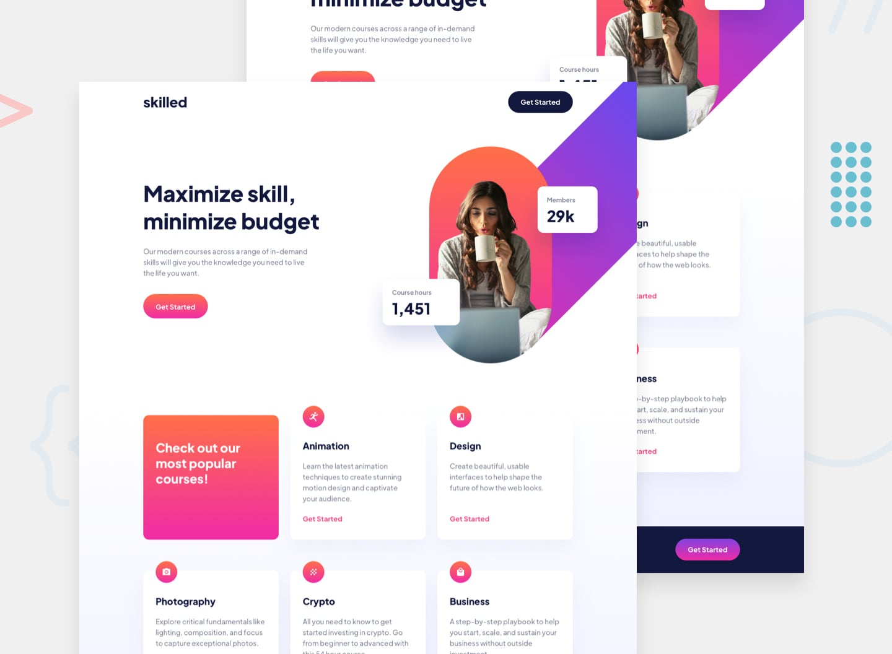

# Frontend Mentor - Skilled e-learning landing page

## The challenge

Your challenge is to build out this landing page and get it looking as close to the design as possible.  

You can use any tools you like to help you complete the challenge. So if you've got something you'd like to practice, feel free to give it a go.  

Your users should be able to:  

- View the optimal layout depending on their device's screen size  
- See hover states for interactive elements  

## Layout

The designs were created to the following widths:  

- Mobile : 375px  
- table  : 768px  
- Desktop: 1440px  

## Colors

### Primary

- Blue-900 : hsl(233,  54%,  16%)  
- Blue-600 : hsl(234,  25%,  52%)  
- Pink-600 : hsl(341,  92%,  62%)  
- Pink-300 : hsl(341, 100%,  83%)  
- Grey     : hsl(232,  10%,  56%)  
- White    : hsl(  0,   0%, 100%)  

- Gradient-Pink   : hsl(322,  87%, 55%) - hsl(13, 100%, 64%)  
- Gradient Purple : hsl(237, 100%, 64%) - hsl(322, 87%, 55%)  

## Typography

- font-family : Plus Jakarta Sans  
- font-weight : 800 700 500  

- handing1 : 56px 120% Extrabold  
- handing2 : 40px 120% Extrabold  
- handing3 : 30px 120% Extrabold  
- handing4 : 24px 120% Extrabold  

- body1 : 18px 150% Medium  
- body3 : 16px 150% Bold  
- body3 : 18px 150% Bold  
